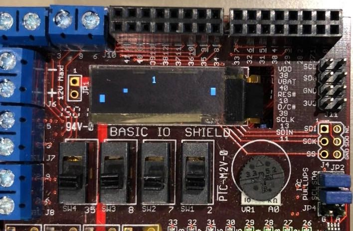

# ping-pong-ChipKIT-project

This was graded as an advanced project. Hardware: PIC32 processor & chipKIT Uno32 Board. The ChipKIT/MCB32 toolchain was used and we worked with the SPI (Serial Peripheral Interface) to communicate with the processor.

Game:
 

 
Main Menu:
 

 
Modes Menu:
 

